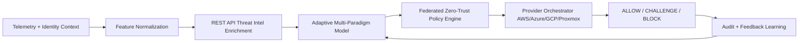

# Implementation Guide (Research-3)

This guide maps Research-1 and Research-2 foundations into the Research-3 executable architecture.

## 1. Target architecture



## 2. Runtime modules and responsibilities

- `src/sif/threat_intel.py`
  - Pulls threat context from API sources + local heuristics.
- `src/sif/model.py`
  - Computes weighted risk score and supports online adaptation.
- `src/sif/zero_trust.py`
  - Converts risk + identity context into deterministic policy decisions.
- `src/sif/orchestrator.py`
  - Maps policy decisions to provider-specific response actions.
- `src/sif/federation.py`
  - Propagates decisions to peer control nodes.
- `src/sif/firewall.py`
  - End-to-end pipeline coordinator.
- `src/sif/multi_tenant.py`
  - Super control account management, tenant assets, telemetry, and upgrade rollout.
- `src/sif/api_server.py`
  - HTTP + WebSocket endpoints for super dashboard and tenant dashboard operations.
- `src/sif/auth.py`
  - JWT issuance/verification and role-based access control (RBAC).

## 3. End-to-end event flow

1. Ingest event payload.
2. Normalize key security features.
3. Enrich event with external threat-intel.
4. Compute risk + confidence from multi-paradigm model.
5. Evaluate federated zero-trust policy.
6. Generate provider action plan.
7. Propagate decision to peers.
8. Persist telemetry and feed future learning.

## 4. Local execution

```bash
PYTHONPATH=src python3 run_firewall.py evaluate --event examples/events/ddos.json
```

Expected output structure:
- `threat_intel`
- `model`
- `decision`
- `orchestration`
- `federation`

## 5. Feedback learning loop

```bash
PYTHONPATH=src python3 run_firewall.py learn --event examples/events/policy_drift.json --label malicious
```

This updates model weights in:

- `state/model_state.json`

## 6. Automated validation

```bash
bash scripts/run_tests.sh
```

## 7. Super control and tenant operation

Start the API server:

```bash
python3 run_control_api.py --host 0.0.0.0 --port 9000
```

Key endpoints:
- `POST /auth/super/login`
- `POST /auth/tenant/login`
- `POST /super/tenants` (create corporate client account)
- `POST /super/tenants/{tenant_id}/assets` (register local/cloud assets)
- `GET /super/dashboard` (global operator metrics)
- `POST /super/upgrades` (publish global version/policy update)
- `POST /tenant/{tenant_id}/events` (tenant-local protection event)
- `GET /tenant/{tenant_id}/dashboard` (tenant monitoring data)
- `POST /tenant/{tenant_id}/sync` (tenant auto-upgrade sync)
- `GET /ws/super?token=<jwt>` (real-time super dashboard stream)
- `GET /ws/tenant/{tenant_id}?token=<jwt>` (real-time tenant stream)

## 8. Proxmox deployment

Use:

- [DEPLOYMENT_PROXMOX_GUIDE.md](DEPLOYMENT_PROXMOX_GUIDE.md)

## 9. Artifact protection and release workflow

1. Update manuscript/source files in `artifacts/`.
2. Rebuild preview + encrypted archives:

```bash
bash scripts/package_encrypted_artifacts.sh
```

3. Publish website from `/docs` via GitHub Pages.
