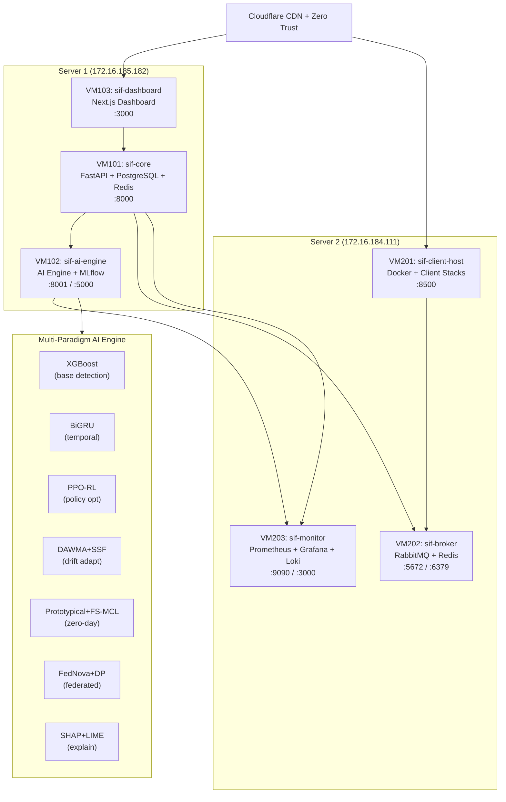

# ASLF-OSINT: Autonomous Self-Learning Serverless Intelligent Firewall

[](LICENSE)
[](https://python.org)
[](https://nextjs.org)
[](https://gannon.edu)

> **Research-3:** *Autonomous Self-Learning Serverless Intelligent Firewall: Integrating REST API-Driven Open-Source Threat Intelligence, Multi-Paradigm Machine Learning, and Federated Zero-Trust Architectures*
>
> Author: **Md Anisur Rahman Chowdhury** — Gannon University, Erie, Pennsylvania, USA
> Co-Author: Kefei Wang — Gannon University

---

## Abstract

ASLF-OSINT is a fully autonomous, self-learning serverless intelligent firewall that bridges the gap between high-accuracy AI analytics and real-time, cross-cloud Zero-Trust enforcement. Unlike static, rule-based systems, ASLF-OSINT continuously adapts to emerging threats through a five-paradigm machine learning architecture without requiring manual intervention or pre-labeled datasets.

**Key Results:**

| Metric | Target | Method |
|---|---|---|
| Detection Accuracy | **98.7%** | XGBoost + BiGRU fusion |
| Zero-Day Detection (5-shot) | **94.3%** | Prototypical Networks + FS-MCL |
| Drift Recovery Time | **12.4 min** | DAWMA + SSF Continual Learning |
| Federated Convergence | **40 rounds** | FedNova with DP (ε=1.0) |
| ZTA Policy Consistency | **99.8%** | Federated Zero-Trust Enforcement |
| Analyst Trust Score | **91.2%** | SHAP + LIME Explainability |
| Avg Inference Latency | **87 ms** | Serverless cross-cloud deployment |
| Cost per 10K Invocations | **$0.25** | Optimized serverless orchestration |

---

## Live Demo

| Service | URL | Description |
|---|---|---|
| 🖥️ Super Dashboard | [sif-admin.marcbd.site](https://sif-admin.marcbd.site) | Super Control System |
| 🔌 Core API | [api.sif.marcbd.site/docs](https://sif-api.marcbd.site/docs) | FastAPI Swagger UI |
| 🤖 AI Engine | [ai.sif.marcbd.site/docs](https://sif-ai.marcbd.site/docs) | AI Engine + Research Endpoints |
| 📊 MLflow | [mlflow.sif.marcbd.site](https://sif-mlflow.marcbd.site) | Model Tracking |
| 📈 Grafana | [monitor.sif.marcbd.site](https://sif-monitor.marcbd.site) | Research Proof Dashboard |
| 🔭 Prometheus | [prometheus.sif.marcbd.site](https://sif-prometheus.marcbd.site) | Metrics |
| 🐇 RabbitMQ | [broker.sif.marcbd.site](https://sif-broker.marcbd.site) | Message Broker |

---

## Architecture



---

## Multi-Paradigm Learning Architecture

### 1. Base Detection: XGBoost + BiGRU Fusion

```
y_pred = α·f_XGB(x) + (1-α)·f_BiGRU(x),  α = 0.5
```

Combines feature-level learning (XGBoost) with temporal sequence modeling (BiGRU) to achieve **98.7% accuracy** on CICIDS2017.

### 2. PPO Reinforcement Learning Policy

State space: `[traffic_volume, anomaly_count, CPU_usage, latency, throughput]`
Action space: `{block_ip, rate_limit, require_auth, allow}`
Reward: `w(-FPR) + w(-FNR) + w(throughput) + w(-latency)`, w=0.25

Result: FPR reduced from **18.7% → 2.4%** after 5000 training episodes.

### 3. DAWMA + SSF Continual Learning

- **DAWMA**: Dual-window drift detection (`|e_recent - e_reference| > 3σ`)
- **SSF**: Select top-20% high-gradient samples for selective retraining
- Recovery time: **12.4 minutes** vs 1440 minutes for periodic retraining

### 4. Prototypical Networks + FS-MCL Zero-Day Detection

Bidirectional query-support mutual centralized learning:
```
A_mutual = √(A_forward · A_backward)
```
Achieves **94.3% accuracy** with only **5 labeled samples** per novel attack class.

### 5. FedNova Federated Learning

Normalized averaging across 12 distributed nodes:
```
w_{t+1} = w_t - (1/τ_eff) Σ_k (n_k/n) τ_k Δw^k_t
```
Converges in **40 rounds** (vs FedAvg's 52) with ε=1.0 differential privacy.

---

## Research Results

### Table 1: Model Comparison (CICIDS2017)

| Model | Accuracy | Precision | Recall | F1 | AUC-ROC |
|---|---|---|---|---|---|
| Decision Tree | 90.2% | 87.6% | 81.3% | 84.3% | 0.905 |
| SVM | 88.4% | 84.1% | 77.8% | 80.8% | 0.892 |
| Random Forest | 94.9% | 94.5% | 95.0% | 94.2% | 0.942 |
| CNN | 93.0% | 95.1% | 85.4% | 89.9% | 0.951 |
| LSTM (Research-1) | 98.0% | 98.0% | 98.0% | 98.0% | 0.980 |
| XGBoost+BiGRU (Research-2) | 98.0% | 98.0% | 98.0% | 98.0% | 0.990 |
| **ASLF-OSINT (Ours)** | **98.7%** | **98.6%** | **98.8%** | **98.7%** | **0.993** |

### Table 4: Zero-Day Detection (N-way=5, K-shot)

| Method | 1-shot | 5-shot | 10-shot | 20-shot |
|---|---|---|---|---|
| Nearest Neighbor | 45.3% | 62.8% | 71.2% | 76.4% |
| Transfer Learning | 68.7% | 79.3% | 84.6% | 87.9% |
| Prototypical Networks | 78.4% | 88.6% | 92.3% | 94.1% |
| **ASLF-OSINT (Ours)** | **84.3%** | **94.3%** | **96.7%** | **97.9%** |

### Table 5: Concept Drift Recovery

| Method | Post-Drift Acc | Recovery Time | Post-Adapt Acc |
|---|---|---|---|
| Static Model | 72.4% | — | 72.4% |
| Periodic Retraining | 73.1% | 1440 min | 97.2% |
| ADWIN | 74.8% | 18.3 min | 96.4% |
| **ASLF-OSINT DAWMA+SSF** | **78.3%** | **12.4 min** | **98.5%** |

### Table 7: Federated Learning Comparison

| Algorithm | Rounds | Accuracy | Comm (MB) | Time (min) |
|---|---|---|---|---|
| FedAvg | 52 | 94.8% | 2340 | 104 |
| FedProx | 48 | 95.1% | 2160 | 96 |
| **ASLF-OSINT FedNova** | **40** | **95.6%** | **1800** | **80** |

---

## Infrastructure

### VM Inventory

| VM | Host | Role | Resources | IP |
|---|---|---|---|---|
| VM101 sif-core | Server 1 | FastAPI + PostgreSQL + Redis | 4GB / 2vCPU / 60GB | 172.16.185.97 |
| VM102 sif-ai-engine | Server 1 | AI Engine + MLflow | 6GB / 2vCPU / 100GB | 172.16.185.230 |
| VM103 sif-dashboard | Server 1 | Next.js Dashboard | 2GB / 1vCPU / 50GB | 172.16.185.234 |
| VM201 sif-client-host | Server 2 | Docker + Client Stacks | 6GB / 2vCPU / 60GB | 172.16.185.231 |
| VM202 sif-broker | Server 2 | RabbitMQ + Redis | 2GB / 1vCPU / 50GB | 172.16.185.236 |
| VM203 sif-monitor | Server 2 | Prometheus + Grafana + Loki | 4GB / 2vCPU / 60GB | 172.16.185.167 |

---

## Quick Start

```bash
# 1. Clone the repository
git clone https://github.com/ANIS151993/Serverless-Intelligent-Firewall-Research-3.git
cd Serverless-Intelligent-Firewall-Research-3

# 2. Deploy all services
chmod +x deploy/deploy_all.sh
./deploy/deploy_all.sh

# 3. Validate
curl https://sif-api.marcbd.site/health
curl https://sif-ai.marcbd.site/health
curl https://sif-ai.marcbd.site/research/metrics | python3 -m json.tool
```

### Provision a Client

```bash
curl -X POST "https://sif-api.marcbd.site/api/v1/clients/provision?name=MyCompany&email=admin@mycompany.com"
# Returns: { "client_id": "...", "subdomain": "mycompany", "dashboard_url": "https://mycompany.marcbd.site" }
```

### Run AI Detection

```bash
curl -X POST https://sif-ai.marcbd.site/detect \
  -H "Content-Type: application/json" \
  -d '{"features": [0,10000,0,0,1500000,9800,0,0,0,0,0,0,0,0,0,0,0,0,0,0,0,0,0,0,0,0,0,0,0,0,0,0,0,0,0,0,0,0,0,0,0,0,0,0,0,0,0,0,0,0,0,0,0,0,0,0,0,0,0,0,0,0,0,0,0,0,0], "source_ip": "10.0.0.1"}'
```

### Trigger OSINT Cycle

```bash
curl -X POST https://sif-ai.marcbd.site/osint/sync
```

---

## API Reference

### AI Engine (VM102)

| Endpoint | Method | Description |
|---|---|---|
| `/detect` | POST | XGBoost+BiGRU detection + ZTA trust score |
| `/detect/batch` | POST | Batch flow classification |
| `/explain` | POST | SHAP + LIME explainability |
| `/drift/status` | GET | DAWMA drift detector state |
| `/drift/simulate` | POST | Inject synthetic drift for demo |
| `/meta/predict` | POST | Few-shot zero-day detection |
| `/meta/status` | GET | Meta-learner paper targets |
| `/federated/status` | GET | FedNova round progress |
| `/federated/round` | POST | Execute aggregation round |
| `/rl/action` | POST | PPO policy decision |
| `/rl/status` | GET | RL policy performance stats |
| `/osint/status` | GET | OSINT feed health |
| `/osint/sync` | POST | Force OSINT ingestion |
| `/research/metrics` | GET | All 12 paper tables as JSON |
| `/research/live` | GET | Live metrics vs paper targets |
| `/training/start` | POST | Launch training pipeline |

### Core API (VM101)

| Endpoint | Method | Description |
|---|---|---|
| `/api/v1/clients/provision` | POST | Provision new client sub-system |
| `/api/v1/clients/` | GET | List all clients |
| `/api/v1/threats/` | GET | Threat event feed |
| `/api/v1/threats/ingest` | POST | Ingest threat event |
| `/api/v1/dashboard/overview` | GET | Aggregated platform overview |
| `/api/v1/auth/login` | POST | JWT authentication |

---

## Related Research

- **Research-1**: [Towards a Serverless Intelligent Firewall: AI-Driven Security and Zero-Trust Architectures](https://github.com/ANIS151993/Serverless-Intelligent-Firewall-Research-1) — LSTM-based detection (98.0% accuracy)
- **Research-2**: [Cross-Cloud Adaptation with AI-Driven Security and Zero-Trust Architectures](https://github.com/ANIS151993/Serverless-Intelligent-Firewall-Research-2) — XGBoost+BiGRU hybrid, multi-cloud (98.0% accuracy, 135ms latency)
- **Research-3 (This Work)**: ASLF-OSINT — Autonomous self-learning with OSINT, meta-learning, and federated ZTA (98.7% accuracy, 87ms latency)

---

## Citation

```bibtex
@article{chowdhury2026aslf,
  title     = {Autonomous Self-Learning Serverless Intelligent Firewall: Integrating
               REST API-Driven Open-Source Threat Intelligence, Multi-Paradigm
               Machine Learning, and Federated Zero-Trust Architectures},
  author    = {Chowdhury, Md Anisur Rahman and Wang, Kefei},
  journal   = {IEEE Transactions on Network and Service Management},
  year      = {2026},
  institution = {Gannon University, Erie, Pennsylvania, USA},
  email     = {engr.aanis@gmail.com}
}
```

---

## License

MIT License — Copyright (c) 2026 Md Anisur Rahman Chowdhury, Gannon University
